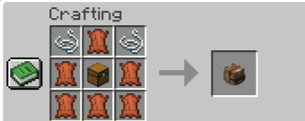
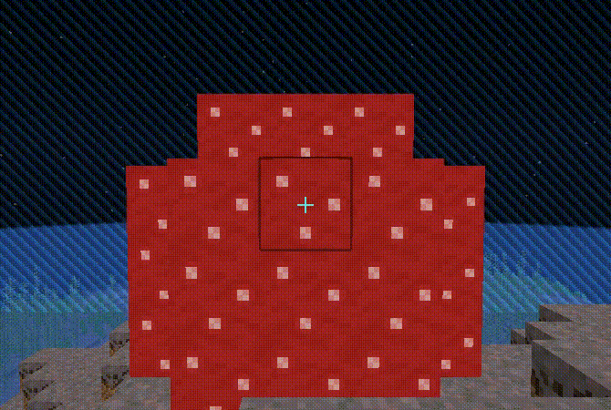
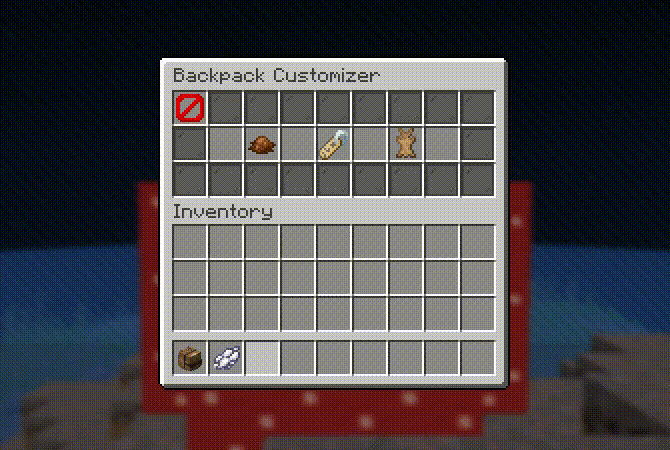
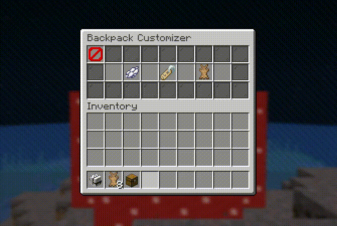

# BackpacksPlus [MC Versions 1.18.1-1.21.7]

 

A comprehensive storage solution plugin for Minecraft servers that adds fully customizable backpacks to enhance your players' inventory management experience.

## Feature Highlights

- **Multiple Sizes**: Upgrade backpacks from 9 to 45 slots
- **Color Customization**: Dye backpacks in any Minecraft color
- **Custom Names**: Personalize your backpacks with names and color codes
- **Persistent Storage**: Contents are saved across server restarts and player sessions, ensuring items are never lost
- **Permission System**: Control access to backpack features
- **Developer API**: Integrate backpacks into your own plugins
- **Custom Crafting**: Fully configurable crafting recipe
- **In-Game Configuration**: Visual configuration GUI for easy setup

## Contents:
- [Getting Started as a Player](#getting-started-as-a-player)
  - [Crafting Backpacks](#crafting-backpacks)
  - [Opening Backpacks](#opening-backpacks)
  - [Customizing Backpacks](#customizing-backpacks)
- [Getting Started as a Server Owner](#getting-started-as-a-server-owner)
    - [Installation](#installation)
    - [Commands](#commands)
    - [Permissions](#permissions)
- [Configuration](#configuration)
    - [In-Game Configuration GUI](#in-game-configuration-gui)
    - [Configuration Options](#configuration-options)
    - [Example Configuration Change](#example-configuration-change)
- [API](#api)
    - [Adding Library to Project](#adding-library-to-project)
    - [Documentation](#documentation)
    - [Usage Example](#usage-example)
- [License](#license)

---

## Getting Started As a Player

### Crafting Backpacks

To craft backpacks, follow the standard recipe shown below (unless the server owner has modified it). The default recipe uses a chest surrounded by leather and string.



### Opening Backpacks

Right or Left click (without sneaking) to open backpacks, where players can place items in or take them out.



### Customizing Backpacks

Shift-Left-click to open the backpack customizer menu.

Players can customize backpacks by dyeing them, renaming them, and upgrading them.


#### Dyeing Backpacks

Place any dye over the "Dye Backpack" item to change backpack colors.



#### Renaming Backpacks

Place a renamed name tag over the "Rename Backpack" item to update backpack display names (up to 30 characters). Names also support color codes.


#### Expanding Backpacks

To expand backpacks, click the "Expand Backpack" item. The costs for each expansion (if not modified by the server owner) are as follows:

- **SMALL** (9 Slots) → **MEDIUM** (18 Slots): 8 Rabbit Hide & 1 Chest
- **MEDIUM** (18 Slots) → **LARGE** (27 Slots): 16 Rabbit Hide & 1 Chest
- **LARGE** (27 Slots) → **GREATER** (36 Slots): 32 Rabbit Hide & 1 Chest
- **GREATER** (36 Slots) → **JUMBO** (45 Slots): 64 Rabbit Hide & 1 Chest



---

## Getting Started As a Server Owner

### Installation

1. Download the plugin from [here](https://nexus.jasonkaranik.com/service/rest/v1/search/assets/download?repository=maven-releases&maven.groupId=com.jasonkaranik&maven.artifactId=backpacksplus&version=1.0.0&maven.extension=jar&maven.classifier=)
2. Place the JAR file in your server's `plugins` folder
3. Start your server
4. Configure the plugin as needed (see Configuration section)

### Commands

| Command | Description | Permission |
|---------|-------------|------------|
| `/backpackconfig` | Opens the backpack configuration menu | `backpacksplus.open_backpack_config_menu` |

### Permissions

BackpacksPlus uses a flexible permission system that server owners can configure in two ways:

1. **Enable/Disable Permission Checks**: In the configuration file, you can toggle whether certain features require permissions at all.
2. **Assign Permissions to Players**: Using your server's permission system to grant specific permissions to players/groups.

#### Permission Nodes

| Permission | Description |
|------------|-------------|
| `backpacksplus.open_backpack_config_menu` | Allows opening the backpack config menu |
| `backpacksplus.open_backpacks` | Grants ability to open backpacks |
| `backpacksplus.dye_backpacks` | Enables dyeing backpacks |
| `backpacksplus.rename_backpacks` | Allows renaming backpacks |
| `backpacksplus.expand_backpacks` | Grants ability to expand backpack capacity |

**Note**: When a permission check is enabled (true), players must have the corresponding permission node to use that feature. When disabled (false), any player can use that feature regardless of permissions.
By default, no players have these permissions unless explicitly granted by server administrators using permission plugins.

---

## Configuration

After first startup, the plugin will generate a `config.json` file in the `plugins/BackpacksPlus` directory. Changes to the configuration require a full server restart to apply.

### In-Game Configuration GUI

For a more intuitive configuration experience, BackpacksPlus provides an in-game GUI accessible through `/backpackconfig` that allows server administrators to visually configure plugin settings without editing the config file directly.

The configuration GUI provides an interactive interface where you can:
- **Configure Default Backpack Settings**: Set the default display name, color, size, and starting contents for newly created backpacks
- **Adjust Expansion Costs**: Configure the required items for each backpack size upgrade (Medium, Large, Greater, and Jumbo) by placing the desired items in the GUI slots

The in-game configuration GUI automatically saves changes to the config file and provides immediate visual feedback. This eliminates the need to manually edit JSON files and reduces configuration errors. Changes made through the GUI still require a server restart to take full effect.

### Configuration Options

#### Backpack Settings
- **crafting_recipe**: Configures the crafting recipe for backpacks.
    - **rows**: Defines the crafting table rows.
        - **1**: Configures the 1st row of the crafting recipe.
        - **2**: Configures the 2nd row.
        - **3**: Configures the 3rd row.
    - **ingredients**: A mapping of key characters (from the rows) to their respective [Material](https://hub.spigotmc.org/javadocs/bukkit/org/bukkit/Material.html).

- **expansion_cost**: Defines the expansion costs for different backpack sizes.
    - **MEDIUM**, **LARGE**, **GREATER**, **JUMBO**: encoded ItemStack arrays for each backpack size.

- **defaults**: Default settings for new backpacks.
    - **display_name**: Default name for the backpack.
    - **color**: Default color of the backpack.
    - **size**: Default size of the backpack.
    - **contents**: Default contents in an encoded ItemStack array.

- **permissions**: Control which features require permissions.
    - **open_backpack_config_menu**: Permission required to open the menu containing backpack configuration settings.
    - **open_backpacks**: Permission required to open backpacks.
    - **dye_backpacks**: Permission required to dye backpacks.
    - **rename_backpacks**: Permission required to rename backpacks.
    - **expand_backpacks**: Permission required to expand backpacks.

### Example Configuration Change

**Default recipe:**
```json
{
    "rows": {
        "1": "SLS",
        "2": "LCL",
        "3": "LLL"
    },
    "ingredients": {
        "S": "STRING",
        "L": "LEATHER",
        "C": "CHEST"
    }
}
```

**Custom recipe (using wool and ender chest)**:
```json
{
    "rows": {
        "1": "WWW",
        "2": "WEW",
        "3": "WWW"
    },
    "ingredients": {
        "W": "WHITE_WOOL",
        "E": "ENDER_CHEST"
    }
}
```

---

## API

### Adding Library to Project

#### Manual:

Download the plugin from the [Installation](#installation) section and add it to your project's classpath.

#### Maven:

Add the following repository and dependency inside the existing `<repositories>` and `<dependencies>` sections of your `pom.xml`:

```xml
<repositories>
    ...
    <repository>
        <id>jasonkaranik-nexus</id>
        <url>https://nexus.jasonkaranik.com/repository/maven-releases/</url>
    </repository>
</repositories>

<dependencies>
    ...
    <dependency>
        <groupId>com.jasonkaranik</groupId>
        <artifactId>backpacksplus</artifactId>
        <version>1.0.0</version>
    </dependency>
</dependencies>
```

#### Gradle:

Add the following repository and dependency inside the existing repositories and dependencies blocks of your `build.gradle` file:

```groovy
repositories {
    ...
    maven {
        url "https://nexus.jasonkaranik.com/repository/maven-releases/"
    }
}

dependencies {
    ...
    implementation "com.jasonkaranik:backpacksplus:1.0.0"
}
```

### Documentation

At the moment, the only available documentation is provided in the [JavaDoc](https://nexus.jasonkaranik.com/service/rest/v1/search/assets/download?repository=maven-releases&maven.groupId=com.jasonkaranik&maven.artifactId=backpacksplus&version=1.0.0&maven.extension=jar&maven.classifier=javadoc).

### Usage Example

See [this](https://github.com/jasonkaranik/backpackspluspresets) plugin which uses the BackpacksPlus API.

---

## License

This project is licensed under the Apache License 2.0. See the [LICENSE](LICENSE) file for more details.
